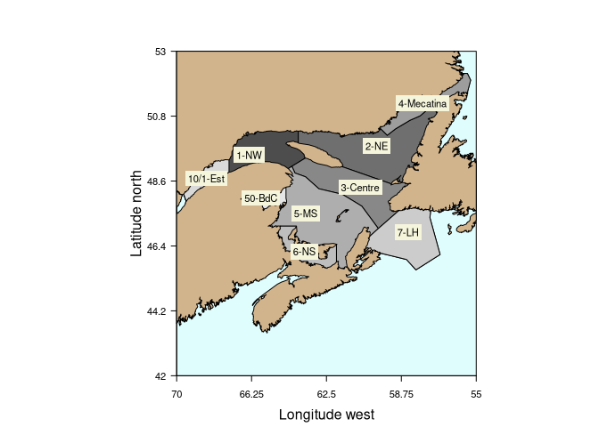
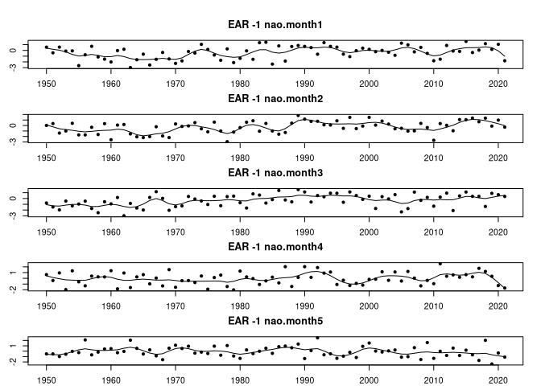
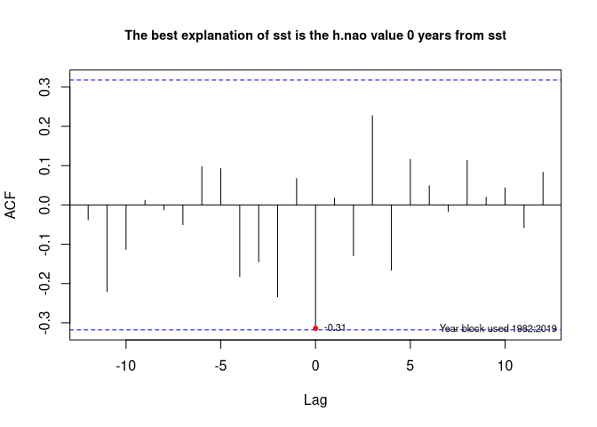
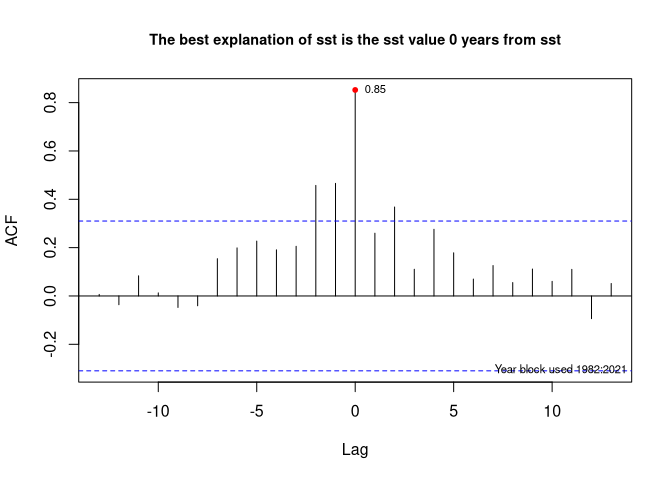
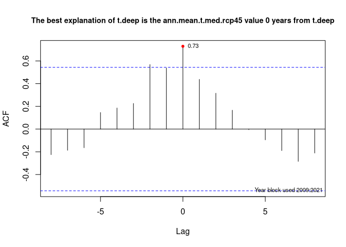

-   [What is it?](#what-is-it)
-   [Quick start](#quick-start)
    -   [Installation troubleshooting](#installation-troubleshooting)
-   [Purpose](#purpose)
-   [Data coverage](#data-coverage)
-   [Design and development
    philosophy](#design-and-development-philosophy)
    -   [List of development goals and
        guidelines](#list-of-development-goals-and-guidelines)
-   [Components of gslea](#components-of-gslea)
    -   [Data objects](#data-objects)
    -   [Functions](#functions)
-   [Installing gslea](#installing-gslea)
-   [Accessing the data](#accessing-the-data)
    -   [Data content overviews](#data-content-overviews)
    -   [Data extraction](#data-extraction)
        -   [Recasting data and showing when there were no
            observations](#recasting-data-and-showing-when-there-were-no-observations)
    -   [Data plotting](#data-plotting)
    -   [Finding variables and data](#finding-variables-and-data)
    -   [Discovering relationship between variables in the
        database](#discovering-relationship-between-variables-in-the-database)
    -   [Using down-scaled atmospheric climate projections to predict
        oceanographic
        variables](#using-down-scaled-atmospheric-climate-projections-to-predict-oceanographic-variables)
-   [Source and references for data](#source-and-references-for-data)
-   [Forget the R-package, I just want the
    data](#forget-the-r-package-i-just-want-the-data)
-   [Work using gslea and links to associated
    code](#work-using-gslea-and-links-to-associated-code)
    -   [Where gslea has been used in research and
        advice](#where-gslea-has-been-used-in-research-and-advice)
    -   [Code and packages that have drawn up
        gslea](#code-and-packages-that-have-drawn-up-gslea)
-   [Development plan and data
    inclusion](#development-plan-and-data-inclusion)
    -   [Multispecies fish and invertebrate survey
        data](#multispecies-fish-and-invertebrate-survey-data)
    -   [Fishing pressure indicators](#fishing-pressure-indicators)
    -   [Down-scaled oceanographic
        projections](#down-scaled-oceanographic-projections)
    -   [Other data](#other-data)
-   [Updating the package](#updating-the-package)
    -   [Computing requirements for
        updating](#computing-requirements-for-updating)
    -   [Raw data](#raw-data)
    -   [Running the update script](#running-the-update-script)
    -   [Updating the R package](#updating-the-r-package)
        -   [Compiling documentation](#compiling-documentation)
        -   [Making the R package](#making-the-r-package)
-   [Project participants (past and
    present)](#project-participants-past-and-present)
-   [If you have issues](#if-you-have-issues)
-   [Citation for this package](#citation-for-this-package)
-   [References](#references)

# What is it?

An R package to house Gulf of St Lawrence environment and ecosystem data
to promote ecosystem research and analysis in the Gulf of St Lawrence
and move us closer to an ecosystem approach to fisheries. It should be
readily understandable to a large swath of the research community who
have extensive or minimal R skills.

Currently version 0.1 - beta. It will not be fixed until version 1
afterwhich updates should not break existing analyses. That could still
happen now with updates.

# Quick start

Open R and install the gslea package and try some commands outlined in
?gslea:

    install.packages("devtools")
    devtools::install_github("duplisea/gslea")
    library(gslea)
    ?gslea

## Installation troubleshooting

IF you are having trouble installing gslea, firstly, you should try to
update R and Rtools to the latest version. Unfortunately on DFO windows
computers, the R version and the Rtools version are likely to be
outdated and if you do not have administrator privileges, you are stuck
with that.

Rtools (you do not need Rtools for Linux or Mac):
<https://cran.r-project.org/bin/windows/Rtools/>

So if you do not have administrator privileges the error I suspect you
will get is:

“Error: (converted from warning) package ‘data.table’ was built under R
version 4.0.3”

The solution to this is to make sure you have devtools installed (above)
and then turnoff the convert warnings to error problem and then try to
reinstall.

    library(devtools)
    Sys.setenv("R_REMOTES_NO_ERRORS_FROM_WARNINGS"=TRUE)
    devtools::install_github("duplisea/gslea")
    library(gslea)

Hopefully, this will allow you to install gslea even though the default
windows binary for data.table was built under a newer version of R than
available on the DFO software repository.

# Purpose

This describes the building of, the structure of and the use of an R
package that gathers up physical, chemical, planktonic, plankton
phenological and fish survey data into one place. This is a standalone R
package that can be called from scripts or other packages for use. The
data are provided spatially by the GSL ecosystem approach regions (EAR)
determined in Quebec Region in Spring 2019 (Fig. 1). Some data indices
that cover areas larger than EARs are provided.

The package has been developed to allow for easy and consistent updating
via automated scripts from tables provides by several individuals. This
means that people should not have to keep pestering say Peter or
Marjolaine to fullfill specific data requests for them. The package has
a very simple data table structure with a minimal set of functions to
understand the structure, query data and plot data roughly for initial
data exploration. Data can then be brought into various analyses for the
GSL that may fall under the banner of an ecosystem approach.

The primary end-user for this work has been envisioned as DFO regional
biologists who are involved in stock assessment and want to begin doing
analyses that incorporate data outside measures of biology of their
specific stock in an effort to expand their analysis to something that
may be considered an ecosystem approach to fisheries. We also, however,
anticipate that this matrix will have a much wider appeal for
researchers in DFO and elsewhere and it should also serve data
dissemination and open data initiatives in the Government of Canada.

# Data coverage

Presently, this package consists of data for the Gulf of St Lawrence
where collection and management of the data is done out of the Quebec
Region. This means that physical, chemical and phenological data
generally cover the entire Gulf of St Lawrence but fish survey data (not
in the database yet) cover only the northern portion as the southern
portion of the Gulf is surveyed by the Gulf Region in Moncton and with a
different survey gear.

There are also some broad climatic, oceangraphic and atmospheric indices
in the database (coded with EAR=-1) such as the North Atlantic
Osciallation. We have presently reserved EAR=0 for GSL scale indices
even though there are none in the database yet.

# Design and development philosophy

The package is GPL-3 licenced and thus is available globally without
warranty. The package is designed to have as few data containers as
possible and in a common and consistent format to allow generic
extraction. The package has only one dependence which is the library
data.table and data.table itself has no dependencies. The data.table
library is used because of its efficient use of computing resources
making it very fast for processing data
(<https://h2oai.github.io/db-benchmark/>) which is important if in
someone’s analysis they make repeated queries to the data in loops or in
bootstrapping directly from the full database. The data are structured
in what has become termed “tidy data” for people in the tidyverse as
opposed to messy data I suppose. You can use your own tidyverse code on
it. The data class “data.table” inherits a secondary class of
data.frame, therefore they are compatible with most of the base R
data.frame operations. The package is designed such that it is
consistent, should be scalable to when new data types become available
and should not break existing analyses when updated (I hope).

## List of development goals and guidelines

-   The package needs to be technically accessible to as wide a swath of
    the envisioned end user community as possible (see Purpose section
    for an explanation of who this is).
-   It must not require permissions to access and use the data and using
    it should be possible within minutes
-   It must be fast to access and have minimal dependencies
-   It must be operating system agnostic
-   It should easily integrate into people’s work flow and analysis
-   Data updates or functionality updates should not break existing
    analyses
-   It should have only minimal data exploration functionality
-   It must conform to Transparent, Traceable and Transferable (TTT)
    ideas (Edwards et al. 2018)
-   It must create a clear flow from data supplier to user and make it
    easy to acknowledge and contact data suppliers
-   It must be relatively easily updatable, updated often and not go
    data-stale
-   It is a secondary data product and is not a primary relational
    database, i.e. it should not contain data that is not available or
    derivable from other existing databases. This also means that
    quality control in gslea is not on the data itself but only specific
    derived products.

These guidelines should be followed closely to prevent “mission creep”
which is likely to lead to failure of the usability of matrix at a later
point.

# Components of gslea

## Data objects

The package consists of three main tables presently:

<ins>
EA.data
</ins>

This is where all the measurements reside. The data.table (inherits
data.frame as second choice) has four columns: <b>year</b>, <b>EAR</b>,
<b>variable</b>, <b>value</b>. Where year is the year (integer) of data
collection, <b>EAR</b> is the ecosystem approach region (see fig 1)
(character), <b>variable</b> is the name of the variable (character),
<b>value</b> is the measured values (numeric). <b>variable</b> is set as
the key variable

<ins>
variable.descriptions
</ins>

this provides a description of the variable in EA.data. This table
contains five columns: <b>variable</b> is the name of the variable
(character), <b>description</b> is a description of the variable and
what is represents, <b>units</b> are the units of measure of the
variable, <b>contact</b> is the name of the contact person who provided
the data, <b>type</b> is the type of data (“physical”, “chemical”,
“planktonic”, “phenological”, “fish”), <b>extraction.date</b> is the
date which the contact person extracted the data from their database.
<b>variable</b> is the key variable. Some of the variables are not just
single measures per year but monthly measures. It was a conscious
decision not to make a sub-year time column in these cases which makes
the extraction result more difficult since often people want data in
two-dimensional tabular format. So for example some of the plankton data
are available by month. In these cases, there is a separate variable for
each month and if it were for September it would end in …month9.

<ins>
field.descriptions
</ins>

this gives a description of the field names in the EA.data especially as
these might need elaboration in some cases. The table contains three
columns: <b>field</b> which is the field name in the EA.data table,
<b>description</b> which describes what is represented by that column,
<b>elaboration</b> which provides more details on the column when
needed. So the elaboration column for <b>EAR</b> describes the areas
represented by each ecoregion code. Elaboration for variable describes
specifically what is meant by a variable containing a name that may
include “early summer”. <b>field</b> is the key variable.

Another data table describes the coordinates of the EAR boundaries in
decimal degrees but you never see that here.

## Functions

The package consists of limited number of functions:

<ins>
metadata.f(verbosity)
</ins>

a description of the data available with three levels of
<b>verbosity</b> (“low” “med”, “high”) or EASTER EGG information on
everyone’s favourite Dutch post-impressionist: metadata.f(“vangogh”).

<ins>
vars.f(variable.type)
</ins>

shows the variables available in a particular <b>variable.type</b>
e.g. “physical”, “chemical” gives a description of each and its units.

<ins>
find.vars.f(search.term)
</ins>

finds variable names based on partial matches. It search not just the
variable names but also their descriptions, sources and references.

<ins>
EA.query.f(variables, years, EARs)
</ins>

the function you use to query the data and the output is in long data
format. <b>variables</b> (e.g. “t150”,“sst”) is a character vector,
<b>years</b> is a numeric vector (e.g. 2002:2012), <b>EARs</b> is the
ecoregion and is a numeric vector (e.g. 1:3).

<ins>
EA.plot.f(variables, years, EARs, …)
</ins>

this will plot the variables over time. It will make a matrix of
variable x EAR with up to 25 plots per page (i.e. 25 variable\*EAR
combinations). <b>variables</b> (e.g. “t150”) is a character vector,
<b>years</b> is a numeric vector (e.g. 2002:2012), <b>EARs</b> is the
ecoregion and is a numeric vector (e.g. 1:3), <b>smoothing</b> is a
logical on whether the smooth.spline should be run through the data
series to help give a general idea of the tendencies in time. It will
only try to smooth if the data has more than 5 observations. <b>….</b>
will accept parameters to par for plotting. This is mostly for quick
exploration of the data rather than for making good quality graphics.

<ins>
EA.cor.f(variables, years, EARs, …)
</ins>

commputes the cross corelation between two variables with lags. It has
the option of differencing the variables to make them stationary and
therefore correlate on the how the values of each of the variables
changes from year to year as opposed to their absolute values. … gives
arguments to the <b>ccf</b> function.

<ins>
sources.f(variable.name)
</ins>

gives a source and reference for any variable in the database. If NULL
then it returns the full list of sources and references. Please cite
these references if using the data.

# Installing gslea

    devtools::install_github("duplisea/gslea", build_vignettes = TRUE)
    library(gslea)

# Accessing the data

## Data content overviews

A few minimal extraction functions are provided that should be fast and
relatively generic. A function called <b>metadata.f</b> is provided with
three levels of verbosity to give you an overview. “low” verbosity just
gives a few stats on the size of the database and the number of
variables and EARs. “med” verbosity will give you names of variables and
units. “high” is not that useful because it pretty well outputs the
entire content of the variable.description table.

    metadata.f(verbosity="low")

    ## $Number.of.variables
    ## [1] 426
    ## 
    ## $Number.of.EARS
    ## [1] 14
    ## 
    ## $Number.of.years
    ## [1] 243
    ## 
    ## $First.and.last.year
    ## [1] 1854 2096
    ## 
    ## $Number.of.observations
    ## [1] 145752

Another perhaps more useful way to know what the database contains is
with the function <b>var.f</b>. <b>var.f</b> accepts as an argument one
of the data types with the default being “all”. The options are the
adjectives for a data type, e.g. “physical”, “chemical”, “planktonic”
which for some data types seems awkward but it is consistent. It will
give you the exact name of the variable, its description and units. The
output can be long and the descriptions are sometimes quite wordy so it
is difficult to read. I suggest you save the result of a large query to
var.f as an object and then use the library formattable to make it into
a more readable table. So for example formattable, e.g.:

    phys.var= vars.f(variable.type="physical")
    formattable::formattable(phys.var)

<table class="table table-condensed">
<thead>
<tr>
<th style="text-align:right;">
variable
</th>
<th style="text-align:right;">
type
</th>
<th style="text-align:right;">
description
</th>
<th style="text-align:right;">
units
</th>
</tr>
</thead>
<tbody>
<tr>
<td style="text-align:right;">
cil.vol.lt.1
</td>
<td style="text-align:right;">
physical
</td>
<td style="text-align:right;">
Volume of water in CIL defined by the &lt;1 C boundary
</td>
<td style="text-align:right;">
km cubed
</td>
</tr>
<tr>
<td style="text-align:right;">
decrease.10
</td>
<td style="text-align:right;">
physical
</td>
<td style="text-align:right;">
Timing of when water first cools to 10 C
</td>
<td style="text-align:right;">
week of the year
</td>
</tr>
<tr>
<td style="text-align:right;">
decrease.12
</td>
<td style="text-align:right;">
physical
</td>
<td style="text-align:right;">
Timing of when water first cools to 12 C
</td>
<td style="text-align:right;">
week of the year
</td>
</tr>
<tr>
<td style="text-align:right;">
first.ice
</td>
<td style="text-align:right;">
physical
</td>
<td style="text-align:right;">
Timing of the first appearance of ice
</td>
<td style="text-align:right;">
day of the year
</td>
</tr>
<tr>
<td style="text-align:right;">
ice.duration
</td>
<td style="text-align:right;">
physical
</td>
<td style="text-align:right;">
Duration of the ice season
</td>
<td style="text-align:right;">
number of days
</td>
</tr>
<tr>
<td style="text-align:right;">
ice.max
</td>
<td style="text-align:right;">
physical
</td>
<td style="text-align:right;">
Day of maximum ice coverage
</td>
<td style="text-align:right;">
day of the year
</td>
</tr>
<tr>
<td style="text-align:right;">
last.ice
</td>
<td style="text-align:right;">
physical
</td>
<td style="text-align:right;">
Timing of the last appearance of ice
</td>
<td style="text-align:right;">
day of the year
</td>
</tr>
<tr>
<td style="text-align:right;">
sst
</td>
<td style="text-align:right;">
physical
</td>
<td style="text-align:right;">
sea surface temperature annual
</td>
<td style="text-align:right;">
degrees celsius
</td>
</tr>
<tr>
<td style="text-align:right;">
sst.anomaly
</td>
<td style="text-align:right;">
physical
</td>
<td style="text-align:right;">
anomaly in sea surface temperature annual
</td>
<td style="text-align:right;">
degrees celsius
</td>
</tr>
<tr>
<td style="text-align:right;">
sst.month10
</td>
<td style="text-align:right;">
physical
</td>
<td style="text-align:right;">
sea surface temperature in October
</td>
<td style="text-align:right;">
degrees celsius
</td>
</tr>
<tr>
<td style="text-align:right;">
sst.month11
</td>
<td style="text-align:right;">
physical
</td>
<td style="text-align:right;">
sea surface temperature in November
</td>
<td style="text-align:right;">
degrees celsius
</td>
</tr>
<tr>
<td style="text-align:right;">
sst.month5
</td>
<td style="text-align:right;">
physical
</td>
<td style="text-align:right;">
sea surface temperature in May
</td>
<td style="text-align:right;">
degrees celsius
</td>
</tr>
<tr>
<td style="text-align:right;">
sst.month6
</td>
<td style="text-align:right;">
physical
</td>
<td style="text-align:right;">
sea surface temperature in June
</td>
<td style="text-align:right;">
degrees celsius
</td>
</tr>
<tr>
<td style="text-align:right;">
sst.month7
</td>
<td style="text-align:right;">
physical
</td>
<td style="text-align:right;">
sea surface temperature in July
</td>
<td style="text-align:right;">
degrees celsius
</td>
</tr>
<tr>
<td style="text-align:right;">
sst.month8
</td>
<td style="text-align:right;">
physical
</td>
<td style="text-align:right;">
sea surface temperature in August
</td>
<td style="text-align:right;">
degrees celsius
</td>
</tr>
<tr>
<td style="text-align:right;">
sst.month9
</td>
<td style="text-align:right;">
physical
</td>
<td style="text-align:right;">
sea surface temperature in September
</td>
<td style="text-align:right;">
degrees celsius
</td>
</tr>
<tr>
<td style="text-align:right;">
start.10
</td>
<td style="text-align:right;">
physical
</td>
<td style="text-align:right;">
Timing of when water first warms to 10 C
</td>
<td style="text-align:right;">
week of the year
</td>
</tr>
<tr>
<td style="text-align:right;">
start.12
</td>
<td style="text-align:right;">
physical
</td>
<td style="text-align:right;">
Timing of when water first warms to 12 C
</td>
<td style="text-align:right;">
week of the year
</td>
</tr>
<tr>
<td style="text-align:right;">
t.deep
</td>
<td style="text-align:right;">
physical
</td>
<td style="text-align:right;">
Bottom temperature in waters &gt; 200m deep
</td>
<td style="text-align:right;">
degrees celsius
</td>
</tr>
<tr>
<td style="text-align:right;">
t.shallow
</td>
<td style="text-align:right;">
physical
</td>
<td style="text-align:right;">
Bottom temperature in waters &lt; 200m deep
</td>
<td style="text-align:right;">
degrees celsius
</td>
</tr>
<tr>
<td style="text-align:right;">
t150
</td>
<td style="text-align:right;">
physical
</td>
<td style="text-align:right;">
Temperature at 150m
</td>
<td style="text-align:right;">
degrees celsius
</td>
</tr>
<tr>
<td style="text-align:right;">
t200
</td>
<td style="text-align:right;">
physical
</td>
<td style="text-align:right;">
Temperature at 200m
</td>
<td style="text-align:right;">
degrees celsius
</td>
</tr>
<tr>
<td style="text-align:right;">
t250
</td>
<td style="text-align:right;">
physical
</td>
<td style="text-align:right;">
Temperature at 250m
</td>
<td style="text-align:right;">
degrees celsius
</td>
</tr>
<tr>
<td style="text-align:right;">
t300
</td>
<td style="text-align:right;">
physical
</td>
<td style="text-align:right;">
Temperature at 300m
</td>
<td style="text-align:right;">
degrees celsius
</td>
</tr>
<tr>
<td style="text-align:right;">
tmax200.400
</td>
<td style="text-align:right;">
physical
</td>
<td style="text-align:right;">
Maximum temperature between 200 and 400m
</td>
<td style="text-align:right;">
degrees celsius
</td>
</tr>
</tbody>
</table>

You can also try to find a variable through partial matching of a term
(case insensitive). So for example if you were interested in just
temperature you might search “temp”. Or anything that is from 200m deep
then search “200”. It will then give you a list of variable that have
that term in their description.

    find.vars.f(search.term= "200")

    ##  [1] "j.gsnw.q1"   "j.gsnw.q2"   "j.gsnw.q3"   "j.gsnw.q4"   "t.deep"     
    ##  [6] "t.shallow"   "t200"        "tmax200.400" "amo.month1"  "amo.month10"
    ## [11] "amo.month11" "amo.month12" "amo.month2"  "amo.month3"  "amo.month4" 
    ## [16] "amo.month5"  "amo.month6"  "amo.month7"  "amo.month8"  "amo.month9" 
    ## [21] "pdo.month1"  "pdo.month10" "pdo.month11" "pdo.month12" "pdo.month2" 
    ## [26] "pdo.month3"  "pdo.month4"  "pdo.month5"  "pdo.month6"  "pdo.month7" 
    ## [31] "pdo.month8"  "pdo.month9"

You will see that t.deep and t.shallow come up in this because in their
descriptions, the distinction between shallow and deep waters is 200m.
You will also see AMO variable coming up and this is because the
reference for the AMO was published in 2001 and 200 is a substring of
that. So you can see it will find things fairly broadly

This search function will search most of the main fields of the
variable.description table. So for example you may be interested in
products which Peter Galbraith was involved with so you could try
find.vars.f(search.term= “galbra”) or say something to do with plankton
blooms find.vars.f(“bloom”).

## Data extraction

Extracting the data is done with a single function called
<b>EA.query.f</b>. This query wants a character vector or scalar for
variable, an integer vector or scalar for year and an integer vector or
scalar for EAR:

    EA.query.f(years=1999:2012, variables=c("t150", "ph_bot.fall", "t250"), EARs=1:2)

    ##     year EAR    variable    value
    ##  1: 2009   1 ph_bot.fall 7.665480
    ##  2: 2011   1 ph_bot.fall 7.650002
    ##  3: 2011   2 ph_bot.fall 7.699617
    ##  4: 1999   1        t150 3.170000
    ##  5: 2000   1        t150 3.100000
    ##  6: 2001   1        t150 3.290000
    ##  7: 2002   1        t150 3.320000
    ##  8: 2003   1        t150 2.880000
    ##  9: 2004   1        t150 3.030000
    ## 10: 2005   1        t150 3.030000
    ## 11: 2006   1        t150 3.580000
    ## 12: 2007   1        t150 2.970000
    ## 13: 2008   1        t150 2.920000
    ## 14: 2009   1        t150 2.920000
    ## 15: 2010   1        t150 2.710000
    ## 16: 2011   1        t150 3.140000
    ## 17: 2012   1        t150 3.380000
    ## 18: 1999   2        t150 3.100000
    ## 19: 2000   2        t150 2.880000
    ## 20: 2001   2        t150 2.480000
    ## 21: 2002   2        t150 2.780000
    ## 22: 2003   2        t150 2.060000
    ## 23: 2004   2        t150 2.100000
    ## 24: 2005   2        t150 2.450000
    ## 25: 2006   2        t150 3.110000
    ## 26: 2007   2        t150 2.320000
    ## 27: 2008   2        t150 1.930000
    ## 28: 2009   2        t150 2.140000
    ## 29: 2010   2        t150 2.650000
    ## 30: 2011   2        t150 2.690000
    ## 31: 2012   2        t150 3.150000
    ## 32: 1999   1        t250 5.060000
    ## 33: 2000   1        t250 4.960000
    ## 34: 2001   1        t250 5.050000
    ## 35: 2002   1        t250 5.130000
    ## 36: 2003   1        t250 5.170000
    ## 37: 2004   1        t250 5.220000
    ## 38: 2005   1        t250 5.220000
    ## 39: 2006   1        t250 5.260000
    ## 40: 2007   1        t250 5.200000
    ## 41: 2008   1        t250 5.050000
    ## 42: 2009   1        t250 5.000000
    ## 43: 2010   1        t250 4.870000
    ## 44: 2011   1        t250 4.980000
    ## 45: 2012   1        t250 5.090000
    ## 46: 1999   2        t250 5.390000
    ## 47: 2000   2        t250 5.580000
    ## 48: 2001   2        t250 5.590000
    ## 49: 2002   2        t250 5.750000
    ## 50: 2003   2        t250 5.750000
    ## 51: 2004   2        t250 5.700000
    ## 52: 2005   2        t250 5.510000
    ## 53: 2006   2        t250 5.640000
    ## 54: 2007   2        t250 5.730000
    ## 55: 2008   2        t250 5.340000
    ## 56: 2009   2        t250 5.060000
    ## 57: 2010   2        t250 5.140000
    ## 58: 2011   2        t250 5.520000
    ## 59: 2012   2        t250 5.890000
    ##     year EAR    variable    value

You need to name all the variables you want to extract but you can
access all the years or all the EARs by putting a wide range on them

    EA.query.f(years=1900:2020, variables=c("t150", "ph_bot.fall", "t250"), EARs=1:99)

    ##      year EAR    variable    value
    ##   1: 2009  10 ph_bot.fall 7.612320
    ##   2: 2011  10 ph_bot.fall 7.595473
    ##   3: 2014  10 ph_bot.fall 7.597316
    ##   4: 2015  10 ph_bot.fall 7.583178
    ##   5: 2016  10 ph_bot.fall 7.567549
    ##  ---                              
    ## 396: 2016   3        t250 6.510000
    ## 397: 2017   3        t250 6.530000
    ## 398: 2018   3        t250 6.510000
    ## 399: 2019   3        t250 6.730000
    ## 400: 2020   3        t250 6.970000

You may want to save the results of a query to an object and then export
it to csv (<b>fwrite</b>) or some other format.

### Recasting data and showing when there were no observations

The data are in long format (tidyverse speak = “tidy data”) which is the
common way to store data in databases. It means that for a variable x
year x EAR comination where there is no observation, there is not a row
in the database either. If you want tabular data (wide) to show when say
and observation was not made for a particular year and variable and EAR,
then you can widen the data using the “dcast” function from data.table

    dat= EA.query.f(years=1900:2020, variables=c("t150","ph_bot.fall","ice.max","o2.late_summer.sat.mean50_100"), EARs=1)
    dcast(dat, year~ variable)

    ##     year ice.max o2.late_summer.sat.mean50_100 ph_bot.fall t150
    ##  1: 1969    4.25                            NA          NA 2.64
    ##  2: 1970    6.61                            NA          NA 2.95
    ##  3: 1971   13.20                            NA          NA 3.35
    ##  4: 1972   10.96                            NA          NA   NA
    ##  5: 1973    9.37                            NA          NA   NA
    ##  6: 1974    8.82                            NA          NA 2.97
    ##  7: 1975    7.60                            NA          NA   NA
    ##  8: 1976    7.54                            NA          NA   NA
    ##  9: 1977    9.61                            NA          NA   NA
    ## 10: 1978   10.87                            NA          NA   NA
    ## 11: 1979   16.86                            NA          NA 4.33
    ## 12: 1980    4.43                            NA          NA   NA
    ## 13: 1981    9.05                            NA          NA   NA
    ## 14: 1982    5.60                            NA          NA   NA
    ## 15: 1983    7.84                            NA          NA   NA
    ## 16: 1984    8.44                            NA          NA   NA
    ## 17: 1985    6.17                            NA          NA   NA
    ## 18: 1986    5.97                            NA          NA   NA
    ## 19: 1987    7.95                            NA          NA 3.12
    ## 20: 1988   10.11                            NA          NA 3.36
    ## 21: 1989    5.77                            NA          NA   NA
    ## 22: 1990    6.85                            NA          NA 2.76
    ## 23: 1991    5.73                            NA          NA 1.71
    ## 24: 1992   10.52                            NA          NA 2.11
    ## 25: 1993   11.73                            NA          NA 2.21
    ## 26: 1994    7.60                            NA          NA 2.86
    ## 27: 1995   11.42                            NA          NA 2.23
    ## 28: 1996    8.84                            NA          NA 2.21
    ## 29: 1997    7.34                            NA          NA 2.62
    ## 30: 1998    5.13                            NA          NA 2.98
    ## 31: 1999    5.27                            NA          NA 3.17
    ## 32: 2000    4.64                            NA          NA 3.10
    ## 33: 2001    4.66                            NA          NA 3.29
    ## 34: 2002    7.43                      74.85196          NA 3.32
    ## 35: 2003    4.53                      77.94120          NA 2.88
    ## 36: 2004    4.91                      79.46163          NA 3.03
    ## 37: 2005    7.67                      75.37610          NA 3.03
    ## 38: 2006    3.22                      69.55593          NA 3.58
    ## 39: 2007    2.31                      79.41540          NA 2.97
    ## 40: 2008    9.61                      80.21454          NA 2.92
    ## 41: 2009    5.48                      77.44965    7.665480 2.92
    ## 42: 2010    1.85                      79.23001          NA 2.71
    ## 43: 2011    1.99                      78.86014    7.650002 3.14
    ## 44: 2012    3.94                      76.54409          NA 3.38
    ## 45: 2013    2.44                      80.88125          NA 3.26
    ## 46: 2014    7.47                      83.09693    7.647305 3.34
    ## 47: 2015    9.12                      76.90995    7.664455 4.19
    ## 48: 2016    3.06                      73.39238    7.629347 4.26
    ## 49: 2017    3.81                      75.99841    7.611966 3.81
    ## 50: 2018    6.08                      82.23750    7.638834 3.24
    ## 51: 2019    5.06                      80.52226    7.638646 3.43
    ## 52: 2020    4.36                            NA          NA 3.56
    ##     year ice.max o2.late_summer.sat.mean50_100 ph_bot.fall t150

This puts each variable as a separate column, it preserves all the years
where at least one of the variables had an observation and it puts NA
for variable x year combinations where there was no observation.

It is important to know that when you do this as above, you are making
2-dimensional table data which is fine if your data are two dimensional.
If you have more than one EAR, then your initial data are 3-dimensional
and when you cast the data to 2-dimensions, a decision needs to made on
how to reduce it to 2-dimensions. This is done with a “group by”
function. By default, dcast will do a group-by as count but you can also
specify other groub-by functions such as sum or mean. You can also,
however, cast multidimension data into a table but it will repeat the
columns for each EAR (note that “EAR” is now in the right hand side of
the formula)

    dat= EA.query.f(years=2015:2020, variables=c("t150","ph_bot.fall","ice.max","o2.late_summer.sat.mean50_100"), EARs=1:100)
    dcast(dat, year~ variable+EAR)

    ##    year ice.max_1 ice.max_2 ice.max_3 ice.max_4 ice.max_5 ice.max_6 ice.max_7
    ## 1: 2015      9.12     15.42     12.98      7.39     29.53      4.76     11.42
    ## 2: 2016      3.06      2.21      1.21      1.90      8.27      1.26      0.03
    ## 3: 2017      3.81      5.98      1.41     12.17      9.91      2.73      0.99
    ## 4: 2018      6.08      4.62      5.67      5.04     16.18      2.76      1.29
    ## 5: 2019      5.06     18.94     13.83      4.93     27.17      3.63      4.14
    ## 6: 2020      4.36      9.86      5.57      7.81     17.06      2.75      1.71
    ##    ice.max_10 ice.max_11 ice.max_30 ice.max_31 ice.max_50
    ## 1:       1.85       7.28       9.99       4.71       1.32
    ## 2:       0.74       2.32       1.20       0.02       0.54
    ## 3:       0.94       2.88       1.20       0.21       0.79
    ## 4:       1.25       4.83       4.83       0.84       1.10
    ## 5:       1.15       4.02       9.28       6.20       1.14
    ## 6:       1.19       3.47       4.15       1.42       1.35
    ##    o2.late_summer.sat.mean50_100_1 o2.late_summer.sat.mean50_100_2
    ## 1:                        76.90995                        88.23709
    ## 2:                        73.39238                        89.03141
    ## 3:                        75.99841                        88.90779
    ## 4:                        82.23750                        91.21643
    ## 5:                        80.52226                        90.17201
    ## 6:                              NA                              NA
    ##    o2.late_summer.sat.mean50_100_3 o2.late_summer.sat.mean50_100_4
    ## 1:                        86.03116                        90.18816
    ## 2:                        86.97931                        90.85565
    ## 3:                        87.49978                        89.81340
    ## 4:                        89.17018                        93.43198
    ## 5:                        88.93582                        90.39068
    ## 6:                              NA                              NA
    ##    o2.late_summer.sat.mean50_100_10 o2.late_summer.sat.mean50_100_11
    ## 1:                         78.15062                         76.62354
    ## 2:                         71.00473                         73.94409
    ## 3:                         77.45907                         75.66042
    ## 4:                         82.16858                         82.25341
    ## 5:                         78.43210                         81.00553
    ## 6:                               NA                               NA
    ##    ph_bot.fall_1 ph_bot.fall_2 ph_bot.fall_3 ph_bot.fall_5 ph_bot.fall_10
    ## 1:      7.664455      7.800129      7.764251      7.744036       7.583178
    ## 2:      7.629347      7.752494      7.744871      7.805870       7.567549
    ## 3:      7.611966      7.725187      7.753973      7.797726       7.558538
    ## 4:      7.638834      7.719959      7.765986      7.840955       7.588689
    ## 5:      7.638646      7.718430      7.747536      7.760601       7.590770
    ## 6:            NA            NA            NA            NA             NA
    ##    ph_bot.fall_11 t150_1 t150_2 t150_3 t150_4 t150_10
    ## 1:       7.728533   4.19   3.69   4.01   0.33    4.06
    ## 2:       7.668149   4.26   3.60   4.03  -0.21    4.11
    ## 3:       7.646781   3.81   2.16   3.35  -0.92    3.46
    ## 4:       7.668735   3.24   2.32   2.72  -0.19    3.10
    ## 5:       7.666020   3.43   2.84   3.26  -0.32    3.50
    ## 6:             NA   3.56   3.59   4.05   1.17    3.49

This wide data now has as many rows as years and as many columns as
variable x EAR. The columns are named with the variable followed by
"\_EAR" to identify the EAR it represents.

## Data plotting

The data plotting function <b>EA.plot.f</b> just queries the EA.data
with <b>EA.query.f</b> and then plots them. It puts all the plots on one
page as a matrix of plots with each row being a variable and each column
being an EAR:

    EA.plot.f(years=1900:2020, variables=c("t150", "ph_bot.fall", "t250"), EARs=1:4, smoothing=T)

It will plot a maximum of 25 plots per page. What you might want to do
is call pdf(“EA.plots.pdf”) xxx dev.off() when doing this and it will
put them all in one pdf in your working directory.

Another example of the plot without smoothing and different graphical
parameters:

    EA.plot.f(years=1900:2020, variables=c("t150", "ph_bot.fall", "t250"), EARs=1:4, smoothing=F, pch=20, lwd=2, col="blue", type="b")

You can see that if there are no data for the variable by EAR
combination, a blank plot is produced in the plot matrix.

You may want to plot all variables of a particular type. You can do this
by selecting the variables with the vars.f function and selecting just
the <b>variable</b> column from its output using “$”

    EA.plot.f(years=1900:2020, variables=vars.f(variable.type="chemical")$variable, EARs=1:2, smoothing=T)

## Finding variables and data

You might be interested in anything to do with large scale oscillation
indices, e.g. North Atlantic Oscillation. These all have an EAR=-1
indicating that the they are measures at scales larger than the EA
regions. You can do search for them with a key word or partial string
and then with that information select the NAO monthly data.

    find.vars.f("oscilla")

    ##  [1] "amo.month1"  "amo.month10" "amo.month11" "amo.month12" "amo.month2" 
    ##  [6] "amo.month3"  "amo.month4"  "amo.month5"  "amo.month6"  "amo.month7" 
    ## [11] "amo.month8"  "amo.month9"  "ao.month1"   "ao.month10"  "ao.month11" 
    ## [16] "ao.month12"  "ao.month2"   "ao.month3"   "ao.month4"   "ao.month5"  
    ## [21] "ao.month6"   "ao.month7"   "ao.month8"   "ao.month9"   "h.nao"      
    ## [26] "nao.month1"  "nao.month10" "nao.month11" "nao.month12" "nao.month2" 
    ## [31] "nao.month3"  "nao.month4"  "nao.month5"  "nao.month6"  "nao.month7" 
    ## [36] "nao.month8"  "nao.month9"  "pdo.month1"  "pdo.month10" "pdo.month11"
    ## [41] "pdo.month12" "pdo.month2"  "pdo.month3"  "pdo.month4"  "pdo.month5" 
    ## [46] "pdo.month6"  "pdo.month7"  "pdo.month8"  "pdo.month9"

    # ah ha, seems that something like "NAO.mon" will do it for us but you don't need to worry about the case
    NAO.vars= find.vars.f("nao.mon")
    #but because variable names are character and you may want them ordered by month you need to sort the names vector
    NAO.vars= NAO.vars[order(nchar(NAO.vars), NAO.vars)]
    EA.plot.f(years=1800:2020, variables=NAO.vars[1:5], EARs=-1, smoothing=T,pch=20)

## Discovering relationship between variables in the database

If you have a hunch that one variable may be driving another, you can do
a fairly simple analysis to at least give you a first crack at testing
your hypothesis by using cross correlation (ccf). ccf is a base R
function that looks at the correlation between two variables at
different time lags. It has been repackaged here to query the data from
the EA.data table with the function <b>EA.cor.f</b>.

So let’s assume for this example that you think that sea surface
temperature in the central Gulf (EAR 3) is related to the North Atlantic
Oscillation at some earlier time (<b>climatic</b> variables always have
EAR=-1) but you are not sure what time lag might be most appropriate.
Here you are assuming NAO is the independent variable and, SST is the
dependent variable

    EA.plot.f(variables=c("h.nao","sst"), years=1900:2020, EARs=c(-1,3), smoothing=T,pch=20)

It is hard to say from just pltotting the data because the length of the
time series are quite different. The cross correlation testing at
various temporal lags will probably help you formulate your hypotheses
better.

    EA.cor.f(x="h.nao", y="sst", years=1900:2020, x.EAR=-1, y.EAR=3)

It is a bit of a downer because your best correlations is between NAO
and SST in the same year (0 lag) and the relationship is not that strong
(about -0.3) and not significant.

To imply the causality you are looking for in such an analysis (because
you specified x as the independent variable and y as the dependent), you
are looking for negative or 0 lags. Positive lags suggest that the y
variable is leading the x. These are all just correlations, only your
hypothesis implies causality.

Let’s try an easy one by choosing two variable you know must be related:
SST in EAR 3 (central Gulf) and SST in EAR 1 (NW Gulf).

    EA.cor.f(x="sst",y="sst", years=1900:2020, x.EAR=1, y.EAR=3)

Yes indeed, they are very tightly positively correlated.

An important thing to note with cross correlation is that it will give
the same result as “cor” only with lag 0. That is, if you try truncating
series yourself and then run “cor” between the two series, you will not
get the same result as ccf. This has to do with the normalisation of the
data at the beginning before lagging in ccf. See the help for EA.cor.f
for more details.

## Using down-scaled atmospheric climate projections to predict oceanographic variables

The database contains atmospheric projections from 24 different global
climate models that have been down-scaled to boxes roughly in the same
area as the EARs. The ensemble medians and confidence intervals of
selected variables are provided and for some variables the
distributional characteristics over the ensemble are also provided.
Ideally, we want and will include the direct oceanographic variable
projections under different carbon emission scenarios but this is
detailed work that is currently underway at IML. The atmospheric
variables are provided here in the meantime (and they will remain)
having been downloaded from www.climateatlas.ca (this is an excellent
site, please check it out).

So as an example of what could be done with this, the annual mean
surface temperature for an EAR has been correlated against the deep
water temperature. The linear model resulting from this is not too bad
and could potential inform a semi-trustable projection (or at least
better than guessing). Follow this code as an example of what could be
done.

      EA.cor.f("ann.mean.t.med.rcp45","t.deep",1950:2020,1,1)

    # lets look from 2009 when the deep water really started warming up, it is a pretty good predictor
      EA.cor.f("ann.mean.t.med.rcp45","t.deep",2009:2020,1,1)

    # fit a linear model and project that model based on the ensemble median prediction until 2095
      tmp= EA.query.f(c("ann.mean.t.med.rcp45","t.deep"),1950:2100,1)
      tmp2= dcast(tmp, year~variable)
      plot(tmp2$ann.mean.t.med.rcp45,tmp2$t.deep)
      rug(tmp2$ann.mean.t.med.rcp45)

      pred.lm= lm(t.deep~ann.mean.t.med.rcp45,data=tmp2)
      summary(pred.lm)

    ## 
    ## Call:
    ## lm(formula = t.deep ~ ann.mean.t.med.rcp45, data = tmp2)
    ## 
    ## Residuals:
    ##      Min       1Q   Median       3Q      Max 
    ## -0.44891 -0.16203 -0.05265  0.12173  0.58400 
    ## 
    ## Coefficients:
    ##                      Estimate Std. Error t value Pr(>|t|)    
    ## (Intercept)           3.61109    0.23661  15.262 3.05e-16 ***
    ## ann.mean.t.med.rcp45  0.58057    0.08185   7.093 4.78e-08 ***
    ## ---
    ## Signif. codes:  0 '***' 0.001 '**' 0.01 '*' 0.05 '.' 0.1 ' ' 1
    ## 
    ## Residual standard error: 0.2547 on 32 degrees of freedom
    ##   (112 observations deleted due to missingness)
    ## Multiple R-squared:  0.6113, Adjusted R-squared:  0.5991 
    ## F-statistic: 50.32 on 1 and 32 DF,  p-value: 4.782e-08

      tmp2$t.deep.pred= predict(pred.lm,newdata=tmp2)
      plot(tmp2$ann.mean.t.med.rcp45,tmp2$t.deep.pred,type="l",col="blue",lwd=3,
           xlab="Annual mean surface temperature down-scaled to EAR 1", ylab= "Bottom temperature of deep (>200 m) waters EAR 1")
      points(tmp2$ann.mean.t.med.rcp45,tmp2$t.deep,pch=20)
      rug(tmp2$ann.mean.t.med.rcp45)
      title(main="RCP 4.5 climate projection until 2095, ensemble median")

If one thinks it is valid to link the atmospheric variable so closely
with deep water temperature at such scales 70+ years into the future
then it can be a basis for extrapolation. As above, perhaps it is better
than guessing but one needs to put a bit of water in their wine for the
interpretation.

# Source and references for data

It is important to acknowledge to the individuals and organisation who
collected the data and or processed it to come up with the indices that
are presented here. In some cases, this downstream acknowledgement may
be the primary means of showing efficacy of their work so please be
diligent about including citations and acknowledgements in your work.

The function sources.f accept a variable name as an argument. It will
give you the name and or link to the person or organisation responsible
for the data represented by that variable. It will also provide the main
citation for that variable.

    formattable::formattable(sources.f(c("t.200","h.nao","o2.fall.doxy2.bottom")))

<table class="table table-condensed">
<thead>
<tr>
<th style="text-align:right;">
variable
</th>
<th style="text-align:right;">
source
</th>
<th style="text-align:right;">
reference
</th>
</tr>
</thead>
<tbody>
<tr>
<td style="text-align:right;">
h.nao
</td>
<td style="text-align:right;">
<https://climatedataguide.ucar.edu/sites/default/files/nao_station_annual.txt>
</td>
<td style="text-align:right;">
Hurrell, J.W., 1995: Decadal trends in the North Atlantic Oscillation
and relationships to regional temperature and precipitation. Science
269, 676-679.
</td>
</tr>
<tr>
<td style="text-align:right;">
o2.fall.doxy2.bottom
</td>
<td style="text-align:right;">
Marjolaine Blais (<marjolaine.blais@dfo-mpo.gc.ca>)
</td>
<td style="text-align:right;">
Blais, M., Galbraith, P.S., Plourde, S., Devine, L. and Lehoux, C. 2021.
Chemical and Biological Oceanographic Conditions in the Estuary and Gulf
of St. Lawrence during 2019. DFO Can. Sci. Advis. Sec. Res. Doc.
2021/002. iv + 66 p. 
</td>
</tr>
</tbody>
</table>

If you just type source.f() you will get the person/organisation
responsible and main reference for all variables in the database.

# Forget the R-package, I just want the data

You are not obliged to use this R-package if you want the data. The data
table and variable description table have been merged and written to an
excel file sheet. The field descriptions have been written to another
sheet in the same excel file. This will be downloaded as part of the R
package from github but you can access just that file directly from the
gslea github root directory if you do not want to download the R
package. It is call “<b>EAdata.dump.xlsx</b>”. You might just download
it and filter the variable column or other columns to choose the data
you want from excel. This file is automatically updated everytime the
gslea library is updated so there should be no discrepency in the data
from the two places.

Please do not forget to acknowledge the sources of the data and cite the
appropriate references that are included in the excel file.

# Work using gslea and links to associated code

## Where gslea has been used in research and advice

-   Conditioning advice for Gulf of St. Lawrence shrimp based on an
    assessment of environment and palusible future climate scenarios.
    January 2020.
-   Risk of climate change impacts on the Gulf of St. Lawrence turbot
    fishery. February 2020.
-   4R herring assessment. November 2020

## Code and packages that have drawn up gslea

-   [Andrew Smith](https://github.com/adsmithca) created a script as a
    [github
    gist](https://gist.github.com/adsmithca/8c00a360292e127cfaef4564df0a7b1d)
    that makes some nice maps drawing on the data in the package using
    several of the tidyverse libraries.

# Development plan and data inclusion

Presently, the development is occuring in Quebec Region but this will be
expanded to include data that are stored and processed by researchers in
the Gulf Region (Moncton) of DFO. Our goal is to get a good example from
Quebec Region and then approach Gulf Region with specific examples that
they could follow. A joint meeting in the Spring of 2020 was the first
step in this cross region data sharing in the matrix.

## Multispecies fish and invertebrate survey data

We have added a preliminary extraction of Quebec Region multispecies
fish and invertebrate biomass data but these will require more quality
control and checking before we will consider them verified. We have
applied species filtering criteria and identified 19 core species that
are well represented by the survey and biomass by ecosystem approach
region and year has been extracted for each of these. We have further
identified 9 commercial species that are in a subset of the core species
and we have further extracted their biomass in juvenile and adult
categories. Finally, we have taken all species caught in the survey and
lumped them into various functional guilds and extracted biomass by
guild.

## Fishing pressure indicators

We have begun working on developing indicators of fishing pressure in
each region which will have multiple measures such as biomass extracted
by fishing as well as effort of various gear types in each of the
regions for as many years as possible. There are many issues with some
of these data such as improper location assignment. We are presently
working on this to try to develop useful pressure indicators related to
fishery removals and effort.

## Down-scaled oceanographic projections

Down-scaled oceanographic variable (physical, chemical, biological)
projections under different ICCP RCP scenarios and ensembles means and
variances will also be provided in the matrix eventually. We have been
in discussion with our regional oceanographers and are developing a plan
to include this information in a future update of the matrix.

## Other data

There have been considerations of including coastal data, stock
assessment results, fine-scaled information. These may be possible to
include in the current structure of gslea and we have also considered
that this kind of information might be better suited to another similar
kind of library but specifically aimed at this information. We need to
keep a consistent approach to the development philoshophy and goals
which can help us decide this.

# Updating the package

<mark>Unless you need to update this database, you do not need to read
this</mark>

It is important that the database can be updated consistently and
quickly. This is done through a series of system calls to bash while
running R in linux using text processing programs like awk and sed and
then manipulation in R.

To update the package you will need the standard packages for doing it
like roxygen and devtools.

## Computing requirements for updating

This package requires linux to update. The reason linux is needed is
because it uses BASH system calls and programs like awk and sed to
pre-process data to make names consisitent, e.g. “Year” to “year” or
other inconsistencies between how raw data is provided by different
people. If data gets provided by people differently between updates then
this will require updating of these scripts.

Once the data are processed and brought into the R package, then it
should be useable by any platform that runs R but I would not know how
to process the raw data in windows. You may be able to do this in
windows10 powershell but I have never tried it so I cannot say it will
work. I do note that powershell does not have “sed” installed by default
and you cannot run R from powershell so I am not sure you could send R
systemcalls to the powershell and if you can the script will fail
without “sed”.

## Raw data

Raw data has been provided in various forms by individual data
providers. Sometimes it is in tabular format while other times it is in
a long format. We need to turn it all into long format and this also
involves standardising variable names.

## Running the update script

The update script is XXXX (I will make a vignette on this including the
data but I have not done this yet) which is run from R. It makes system
calls to the working directory you set. That working directory can be
anywhere on your machine and you need to make sure there are
sub-directories of that which are named by the data provider. So Peter
Galbraith has supplied the physical oceanographic data and therefore the
subdirectory is called galbraith. His raw .dat files are located there.
These are text files of a sort that Peter extracts with commented (\#)
header lines describing the data and finishing with the data itself.
Marjolaine Blais has supplied the chemical, planktonic and phenological
variables is various forms. The subdirectory blais also has
subdirectories for zooplankton, oxygen, pH etc. Aside from the data
itself, the two other tables need to be imported into R. These sheets in
an excel file describing the data. At first I was pulling this
information from the headers but there were a lot of differences and
this was creating very one-off fragile scripts that I knew would likely
break on each update. Therefore, the excel sheets have been created to
keep this information. You will need to edit them in excel. The good
thing is that all you will have to alter for a simple update is the
extraction date. If you add new variables though, you will need to add a
new line with all the information about that variable.

If this is all in order on your machine, you just need to run the update
script in the R command line. The script will manipulate the data and
save each data.table as an .rda file in your data directory for the R
package.

I doubt it will go this smoothly but I hope so.

## Updating the R package

### Compiling documentation

If you changed the documentation for the datasets or functions, you need
to recompile the documentation using roxygen2.

### Making the R package

Clean and rebuild

# Project participants (past and present)

Jérôme Beaulieu, Hugues Benoît, Marjolaine Blais, Hugo Bourdages, Daniel
Duplisea, Peter Galbraith, Mike Hammill, Cédric Juillet, David Merette,
Stéphane Plourde, Marie-Julie Roux, Bernard Sainte-Marie, Antoine
Rivierre, Virginie Roy

# If you have issues

For comments, questions, bugs etc, you can send this to the package
maintainer, Daniel Duplisea, by email (<daniel.duplisea@gmail.com>,
<daniel.duplisea@dfo-mpo.gc.ca>) or file a bug report or issue on
github.

Pull requests conforming to the development philosophy are welcome.

# Citation for this package

Duplisea, DE. Merette, D., Roux, M-J., Benoît, H., Blais, M., Galbraith,
P., Plourde, S. 2020. gslea: the Gulf of St Lawrence ecosystem approach
data matrix R-package. R package version 0.1
<https://github.com/duplisea/gslea>.

# References

Edwards, A.M., Duplisea, D.E., Grinnell, M.H., Anderson, S.C., Grandin,
C.J., Ricard, D., Keppel, E.A., Anderson, E.D., Baker, K.D., Benoît,
H.P., Cleary, J.S., Connors, B.M., Desgagnés, M., English, P.A.,
Fishman, D.J., Freshwater, C., Hedges, K.J., Holt, C.A., Holt, K.R.,
Kronlund, A.R., Mariscak, A., Obradovich, S.G., Patten, B.A., Rogers,
B., Rooper, C.N., Simpson, M.R., Surette, T.J., Tallman, R.F., Wheeland,
L.J., Wor, C., and Zhu, X. 2018. Proceedings of the Technical Expertise
in Stock Assessment (TESA) national workshop on ‘Tools for transparent,
traceable, and transferable assessments,’ 27–30 November 2018 in
Nanaimo, British Columbia. Can. Tech. Rep. Fish. Aquat. Sci. 3290: v +
10 p. <https://waves-vagues.dfo-mpo.gc.ca/Library/40750152.pdf>
