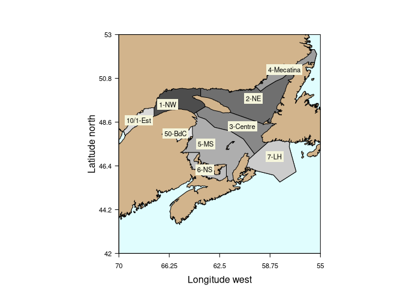

# What is it?

An R package to house Gulf of St Lawrence environment and ecosystem data to promote ecosystem research and analysis in the Gulf of St Lawrence and move us closer to an ecosystem approach to fisheries. It should be readily understandable to a large swath of the research community who have extensive or minimal R skills.

Currently version 0.1 - beta. It will not be fixed until version 1 afterwhich updates should not break existing analyses. That could still happen now with updates.


# Quick start

Open R and install the gslea package and try some commands outlined in ?gslea:

```{r quickstart, eval=FALSE}
devtools::install_github("duplisea/gslea", build_vignettes = TRUE)
library(gslea)
?gslea
```

# Purpose
This describes the building of, the structure of and the use of an R package that gathers up physical, chemical, planktonic, plankton phenological and fish survey data into one place. This is a standalone R package that can be called from scripts or other packages for use. The data are provided spatially by the GSL ecosystem approach regions (EAR) determined in Quebec Region in Spring 2019 (Fig. 1). Some data indices that cover areas larger than EARs are provided.

The package has been developed to allow for easy and consistent updating via automated scripts from tables provides by several individuals. This means that people should not have to keep pestering say Peter or Marjolaine to fullfill specific data requests for them. The package has a very simple data table structure with a minimal set of functions to understand the structure, query data and plot data roughly for initial data exploration. Data can then be brought into various analyses for the GSL that may fall under the banner of an ecosystem approach.

# Data coverage
Presently, this package consists of data for the Gulf of St Lawrence where collection and management of the data is done out of the Quebec Region. This means that physical, chemical and phenological data generally cover the entire Gulf of St Lawrence but fish survey data (not in the database yet) cover only the northern portion as the southern portion of the Gulf is surveyed by the Gulf Region in Moncton and with a different survey gear.

There are also some broad climatirc, oceangraphic and atmospheric indices in the database (coded with EAR=-1) such as the North Atlantic Osciallation. We have presently reserved EAR=0 for GSL scale indices even though there are none in the database yet.

{width=100%}

# Design
The package is GPL-3 licenced and thus is available globally without warranty. The package is designed to have as few data containers as possible and in a common and consistent format to allow generic extraction. The package has only one dependence which is the library data.table and data.table itself has no dependencies. The data.table library is used because of its efficient use of computing resources making it very fast for processing data (https://h2oai.github.io/db-benchmark/) which is important if in someone’s analysis they make repeated queries to the data in loops or in bootstrapping directly from the full database. The data are structured in what has become termed “tidy data” for people in the tidyverse as opposed to dirty data I suppose. You can use your own tidyverse code on it. The data class "data.table" inherit a secondary class of data.frame, therefore they are compatible with most of the base R data.frame operations. The package is designed such that it is consistent, should be scalable to when new data types become available and should not break existing analyses when updated (I hope).

# Components of gslea

## Data objects
The package consists of three main tables presently:

<ins>EA.data</ins> This is where all the measurements reside. The data.table (inherits data.frame as second choice) has four columns: <b>year</b>, <b>EAR</b>, <b>variable</b>, <b>value</b>. Where year is the year (integer) of data collection, <b>EAR</b> is the ecosystem approach region (see fig 1) (character), <b>variable</b> is the name of the variable (character), <b>value</b> is the measured values (numeric). <b>variable</b> is set as the key variable

<ins>variable.descriptions</ins> this provides a description of the variable in EA.data. This table contains five columns: <b>variable</b> is the name of the variable (character), <b>description</b> is a description of the variable and what is represents, <b>units</b> are the units of measure of the variable, <b>contact</b> is the name of the contact person who provided the data, <b>type</b> is the type of data (“physical”, “chemical”, “planktonic”, “phenological”, “fish”), <b>extraction.date</b> is the date which the contact person extracted the data from their database. <b>variable</b> is the key variable.
Some of the variables are not just single measures per year but monthly measures. It was a conscious decision not to make a sub-year time column in these cases which makes the extraction result more difficult since often people want data in two-dimensional tabular format. So for example some of the plankton data are available by month. In these cases, there is a separate variable for each month and if it were for September it would end in ...month9.

<ins>field.descriptions</ins> this gives a description of the field names in the EA.data especially as these might need elaboration in some cases. The table contains three columns: <b>field</b> which is the field name in the EA.data table, <b>description</b> which describes what is represented by that column, <b>elaboration</b> which provides more details on the column when needed. So the elaboration column for <b>EAR</b> describes the areas represented by each ecoregion code. Elaboration for variable describes specifically what is meant by a variable containing a name that may include “early summer”. <b>field</b> is the key variable.

Another data table describes the coordinates of the EAR boundaries in decimal degrees but you never see that here.

## Functions

The package consists of limited number of functions:

<ins>metadata.f(verbosity)</ins> a description of the data available with three levels of <b>verbosity</b> ("low" "med", "high") or information on everyone's favourite Dutch post-impressionist (lowercase no spaces).

<ins>vars.f(variable.type)</ins> shows the variables available in a particular <b>variable.type</b> ("physical", "chemical", "planktonic", "phenologic", "climatic"), gives a description of each and its units.

<ins>find.vars.f(search.term)</ins> finds variable names based on partial matches. It search not just the variable names but also their descriptions, sources and references.

<ins>EA.query.f(variables, years, EARs) </ins> the function you use to query the data and the output is in long data format. <b>variables</b> (e.g. "T150","SST") is a character vector, <b>years</b> is a numeric vector (e.g. 2002:2012), <b>EARs</b> is the ecoregion and is a numeric vector (e.g. 1:3).

<ins>EA.plot.f(variables, years, EARs, ...)</ins> this will plot the variables over time. It will make a matrix of variable x EAR with up to 25 plots per page (i.e. 25 variable*EAR combinations). <b>variables</b> (e.g. "T150") is a character vector, <b>years</b> is a numeric vector (e.g. 2002:2012), <b>EARs</b> is the ecoregion and is a numeric vector (e.g. 1:3), <b>smoothing</b> is a logical on whether the smooth.spline should be run through the data series to help give a general idea of the tendencies in time. It will only try to smooth if the data has more than 5 observations. <b>....</b> will accept parameters to par for plotting. This is mostly for quick exploration of the data rather than for making good quality graphics.

<ins>EA.cor.f(variables, years, EARs, ...)</ins> commputes the cross corelation between two variables with lags. It has the option of differencing the variables to make them stationary and therefore correlate on the how the values of each of the variables changes from year to year as opposed to their absolute values. ... gives arguments to the <b>ccf</b> function.

<ins>sources.f(variable.name)</ins> gives a source and reference for any variable in the database. If NULL then it returns the full list of sources and references. Please cite these references if using the data.

# Installing gslea

```{r setup, include=FALSE}
knitr::opts_chunk$set(echo = TRUE)
```

```{r install, eval=FALSE}
devtools::install_github("duplisea/gslea", build_vignettes = TRUE)
library(gslea)
```

```{r ldlib, eval=TRUE, include=FALSE}
library(gslea)
```

# Accessing the data
## Data content overviews
A few minimal extraction functions are provided that should be fast and relatively generic. A function called <b>metadata.f</b> is provided with three levels of verbosity to give you an overview. “low” verbosity just gives a few stats on the size of the database and the number of variables and EARs. “med” verbosity will give you names of variables and units. “high” is not that useful because it pretty well outputs the entire content of the variable.description table.

```{r metadata, eval=TRUE}
metadata.f(verbosity="low")
```

Another perhaps more useful way to know what the database contains is with the function <b>var.f</b>. <b>var.f</b> accepts as an argument one of the data types with the default being “all”. The options are the adjectives for a data type: "physical", "chemical", "planktonic", "phenological" which for some data types seems awkward but it is consistent. It will give you the exact name of the variable, its description and units. The output can be long and the descriptions are sometimes quite wordy so it is difficult to read. I suggest you save the result of a large query to var.f as an object and then use the library formattable to make it into a more readable table. So for example formattable, e.g.:

```{r variables, eval=TRUE}
phys.var= vars.f(variable.type="physical")
formattable::formattable(phys.var)
```

You can also try to find a variable through partial matching of a term (case insensitive). So for example if you were interested in just temperature you might search "temp". Or anything that is from 300m deep then search "300". It will then give you a list of variable that have that term in their description.

```{r vargrep, eval=TRUE}
find.vars.f(search.term= "200")
```

You will see that T.deep and T.shallow come up in this because in their descriptions, the distinction between shallow and deep waters is 200m. You will also see AMO variable coming up and this is because the reference for the AMO was published in 2001 and 200 is a substring of that. So you can see it will find things fairly broadly

This search function will search most of the main fields of the variable.description table. So for example you may be interested in products which Peter Galbraith was involved with so you could try find.vars.f(search.term= "galbra") or say something to do with plankon blooms find.vars.f("bloom").

## Data extraction
Extracting the data is done with a single function called <b>EA.query.f</b>. This query wants a character vector or scalar for variable, an integer vector or scalar for year and an integer vector or scalar for EAR:

```{r extraction1, eval=TRUE}
EA.query.f(years=1999:2012, variables=c("T150", "ph_bot.fall", "T250"), EARs=1:2)
```

You need to name all the variables you want to extract but you can access all the years or all the EARs by putting a wide range on them

```{r extraction2, eval=TRUE}
EA.query.f(years=1900:2020, variables=c("T150", "ph_bot.fall", "T250"), EARs=1:99)
```

You may want to save the results of a query to an object and then export it to csv (<b>fwrite</b>) or some other format.

### Recasting data and showing when there were no observations
The data are in long format (tidyverse speak = "tidy data") which is the common way to store data in databases. It means that for a variable x year x EAR comination where there is no observation, there is not a row in the database either. If you want tabular data (wide) to show when say and observation was not made for a particular year and variable and EAR, then you can widen the data using the "dcast" function from data.table

```{r recasting, eval=TRUE}
dat= EA.query.f(years=1900:2020, variables=c("T150","ph_bot.fall","ice.max","O2.Late_summer.sat.mean50_100"), EARs=1)
dcast(dat, year~ variable)
```

This puts each variable as a separate column, it preserves all the years where at least one of the variables had an observation and it puts NA for variable x year combinations where there was no observation.

It is important to know that when you do this as above, you are making 2-dimensional table data which is fine if your data are two dimensional. If you have more than one EAR, then your initial data are 3-dimensional and when you cast the data to 2-dimensions, a decision needs to made on how to reduce it to 2-dimensions. This is done with a "group by" function. By default, dcast will do a group-by as count but you can also specify other groub-by functions such as sum or mean. You can also, however, cast multidimension data into a table but it will repeat the columns for each EAR (note that "EAR" is now in the right hand side of the formula)

```{r recasting2, eval=TRUE}
dat= EA.query.f(years=2015:2020, variables=c("T150","ph_bot.fall","ice.max","O2.Late_summer.sat.mean50_100"), EARs=1:100)
dcast(dat, year~ variable+EAR)
```
This wide data now has as many rows as years and as many columns as variable x EAR. The columns are named with the variable followed by "_EAR" to identify the EAR it represents.

## Data plotting
The data plotting function <b>EA.plot.f</b> just queries the EA.data with <b>EA.query.f</b> and then plots them. It puts all the plots on one page as a matrix of plots with each row being a variable and each column being an EAR:

```{r plotting1, eval=TRUE}
EA.plot.f(years=1900:2020, variables=c("T150", "ph_bot.fall", "T250"), EARs=1:4, smoothing=T)
```

It will plot a maximum of 25 plots per page. What you might want to do is call pdf("EA.plots.pdf") xxx dev.off() when doing this and it will put them all in one pdf in your working directory.

Another example of the plot without smoothing and different graphical parameters:

```{r plotting2, eval=TRUE}
EA.plot.f(years=1900:2020, variables=c("T150", "ph_bot.fall", "T250"), EARs=1:4, smoothing=F, pch=20, lwd=2, col="blue", type="b")
```

You can see that if there are no data for the variable by EAR combination, a blank plot is produced in the plot matrix.

You may want to plot all variables of a particular type. You can do this by selecting the variables with the vars.f function and selecting just the <b>variable</b> column from its output using "$"
```{r plotting3, eval=TRUE}
EA.plot.f(years=1900:2020, variables=vars.f(variable.type="phenological")$variable, EARs=1:2, smoothing=T)
```

## Finding variables and data
You might be interested in anything to do with large scale oscillation indices, e.g. North Atlantic Oscillation. These all have an EAR=-1 indicating that the they are measures at scales larger than the EA regions. You can do search for them with a key word or partial string and then with that information select the NAO monthly data.

```{r plotting4, eval=TRUE}
find.vars.f("oscilla")
# ah ha, seems that something like "NAO.mon" will do it for us but you don't need to worry about the case
NAO.vars= find.vars.f("nao.mon")
#but because variable names are character and you may want them ordered by month you need to sort the names vector
NAO.vars= NAO.vars[order(nchar(NAO.vars), NAO.vars)]
EA.plot.f(years=1800:2020, variables=NAO.vars[1:5], EARs=-1, smoothing=T,pch=20)
```

## Discovering relationship between variables in the database
If you have a hunch that one variable may be driving another, you can do a fairly simple analysis to at least give you a first crack at testing your hypothesis by using cross correlation (ccf). ccf is a base R function that looks at the correlation between two variables at different time lags. It has been repackaged here to query the data from the EA.data table with the function <b>EA.cor.f</b>.

So let's assume for this example that you think that sea surface temperature in the central Gulf (EAR 3) is related to the North Atlantic Oscillation at some earlier time (<b>climatic</b> variables always have EAR=-1) but you are not sure what time lag might be most appropriate. Here you are assuming NAO is the independent variable and, SST is the dependent variable

```{r crosscor1, eval=TRUE}
EA.plot.f(variables=c("H.NAO","SST"), years=1900:2020, EARs=c(-1,3), smoothing=T,pch=20)
```

It is hard to say from just plotting the data because the length of the time series are quite different. The cross correlation testing at various temporal lags will probably help you formulate your hypotheses better.

```{r crosscor2, eval=TRUE}
EA.cor.f(x="H.NAO", y="SST", years=1900:2020, x.EAR=-1, y.EAR=3)
```

It is a bit of a downer because your best correlations is between NAO and SST in the same year (0 lag) and the relationship is not that strong (about -0.3) and not significant. So let's try an easy one by choosing two variable you know must be related: SST in EAR 3 (central Gulf) and SST in EAR 1 (NW Gulf).

```{r crosscor3, eval=TRUE}
EA.cor.f(x="SST",y="SST", years=1900:2020, x.EAR=1, y.EAR=3)
```

## Using down-scaled atmospheric climate projections to predict oceanographic variables

The database contains atmospheric projections from 24 different global climate models that have been down-scaled to boxes roughly in the same area as the EARs. The ensemble medians and confidence intervals of selected variables are provided and for some variables the distributional characteristics over the ensemble are also provided. Ideally, we want and will include the direct oceanographic variable projections under different carbon emission scenarios but this is detailed work that is currently underway at IML. The atmospheric variables are provided here in the meantime (and they will remain) having been downloaded from www.climateatlas.ca (this is an excellent site, please check it out).

So as an example of what could be done with this, the annual mean surface temperature for an EAR has been correlated against the deep water temperature. The linear model resulting from this is not too bad and could potential inform a semi-trustable projection (or at least better than guessing). Follow this code as an example of what could be done.

```{r climproject, eval=TRUE}
  EA.cor.f("Ann.mean.T.med.RCP45","T.deep",1950:2020,1,1)

# lets look from 2009 when the deep water really started warming up, it is a pretty good predictor
  EA.cor.f("Ann.mean.T.med.RCP45","T.deep",2009:2020,1,1)

# fit a linear model and project that model based on the ensemble median prediction until 2095
  tmp= EA.query.f(c("Ann.mean.T.med.RCP45","T.deep"),1950:2100,1)
  tmp2= dcast(tmp, year~variable)
  plot(tmp2$Ann.mean.T.med.RCP45,tmp2$T.deep)
  rug(tmp2$Ann.mean.T.med.RCP45)
  pred.lm= lm(T.deep~Ann.mean.T.med.RCP45,data=tmp2)
  summary(pred.lm)
  tmp2$T.deep.pred= predict(pred.lm,newdata=tmp2)
  plot(tmp2$Ann.mean.T.med.RCP45,tmp2$T.deep.pred,type="l",col="blue",lwd=3,
       xlab="Annual mean surface temperature down-scaled to EAR 1", ylab= "Bottom temperature of deep (>200 m) waters EAR 1")
  points(tmp2$Ann.mean.T.med.RCP45,tmp2$T.deep,pch=20)
  rug(tmp2$Ann.mean.T.med.RCP45)
  title(main="RCP 4.5 climate projection until 2095, ensemble median")
```


# Source and references for data
It is important to acknowledge to the individuals and organisation who collected the data and or processed it to come up with the indices that are presented here. In some cases, this downstream acknowledgement may be the primary means of showing efficacy of their work so please be diligent about including citations and acknowledgements in your work.

The function sources.f accept a variable name as an argument. It will give you the name and or link to the person or organisation responsible for the data represented by that variable. It will also provide the main citation for that variable.

```{r sources, eval=TRUE}
formattable::formattable(sources.f(c("T200","H.NAO","O2.Fall.DOXY2.bottom")))
```

If you just type source.f() you will get the person/organisation responsible and main reference for all variables in the database.

# Forget the R-package, I just want the data
You are not obliged to use this R-package if you want the data. The data table and variable description table have been merged and written to an excel file sheet. The field descriptions have been written to another sheet in the same excel file. This will be downloaded as part of the R package from github but you can access just that file directly from the gslea github root directory if you do not want to download the R package. It is call "<b>EAdata.dump.xlsx</b>". You might just download it and filter the variable column or other columns to choose the data you want from excel. This file is automatically updated everytime the gslea library is updated so there should be no discrepency in the data from the two places.

Please do not forget to acknowledge the sources of the data and cite the appropriate references that are included in the excel file.

# Updating the package
<mark>Unless you need to update this database, you do not need to read this</mark>

It is important that the database can be updated consistently and quickly. This is done through a series of system calls to bash while running R in linux using text processing programs like awk and sed and then manipulation in R.

To update the package you will need the standard packages for doing it like roxygen and devtools.

## Computing requirements for updating

This package requires linux to update. The reason linux is needed is because it uses BASH system calls and programs like awk and sed to pre-process data to make names consisitent, e.g. “Year” to “year” or other inconsistencies between how raw data is provided by different people. If data gets provided by people differently between updates then this will require updating of these scripts.

Once the data are processed and brought into the R package, then it should be useable by any platform that runs R but I would not know how to process the raw data in windows. You may be able to do this in windows10 powershell but I have never tried it so I cannot say it will work. I do note that powershell does not have "sed" installed by default and you cannot run R from powershell so I am not sure you could send R systemcalls to the powershell and if you can the script will fail without "sed".

## Raw data
Raw data has been provided in various forms by individual data providers. Sometimes it is in tabular format while other times it is in a long format. We need to turn it all into long format and this also involves standardising variable names.

## Running the update script
The update script is XXXX which is run from R. It makes system calls to the working directory you set. That working directory can be anywhere on your machine and you need to make sure there are sub-directories of that which are named by the data provider. So Peter Galbraith has supplied the physical oceanographic data and therefore the subdirectory is called galbraith. His raw .dat files are located there. These are text files of a sort that Peter extracts with commented (#) header lines describing the data and finishing with the data itself. Marjolaine Blais has supplied the chemical, planktonic and phenological variables is various forms. The subdirectory blais also has subdirectories for zooplankton, oxygen, pH etc.
Aside from the data itself, the two other tables need to be imported into R. These sheets in an excel file describing the data. At first I was pulling this information from the headers but there were a lot of differences and this was creating very one-off fragile scripts that I knew would likely break on each update. Therefore, the excel sheets have been created to keep this information. You will need to edit them in excel. The good thing is that all you will have to alter for a simple update is the extraction date.  If you add new variables though, you will need to add a new line with all the information about that variable.

If this is all in order on your machine, you just need to run the update script in the R command line. The script will manipulate the data and save each data.table as an .rda file in your data directory for the R package.

I doubt it will go this smoothly but I hope so.

## Updating the R package

### Compiling documentation
If you changed the documentation for the datasets or functions, you need to recompile the documentation using roxygen2.

### Making the R package
Clean and rebuild


# Project participants (past and present)

Jérôme Beaulieu, Hugues Benoît, Marjolaine Blais, Hugo Bourdages, Daniel Duplisea, Peter Galbraith, Mike Hammill, Cédric Juillet, David Merette, Stéphane Plourde, Marie-Julie Roux, Bernard Sainte-Marie, Antoine Rivierre

# If you have issues
For comments, questions, bugs etc, you can send this to the package maintainer, Daniel Duplisea, by email (daniel.duplisea@gmail.com) or file a bug report or issue on github.

# Citation

Duplisea, DE. 2020. Gulf of St Lawrence ecosystem approach: gslea. R package version 0.1 https://github.com/duplisea/gslea.
